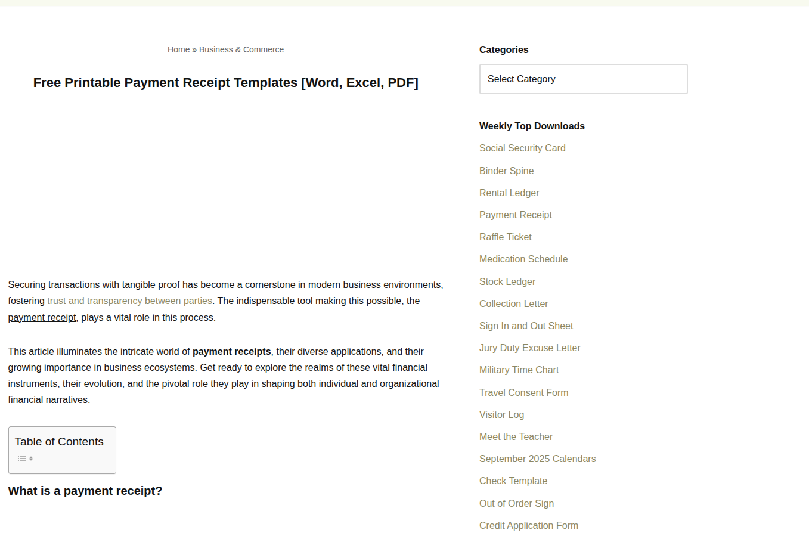

# 🧠 Moringa AI Capstone Project: Beginner’s Toolkit with GenAI  
**Title:** “Prompt-Powered Kickstart: Building a Beginner’s Toolkit for Tesseract.js OCR”  

## 1. Title & Objective  
**Technology Chosen:** Tesseract.js (JavaScript OCR library)  

**Why I chose it:**  
- OCR (Optical Character Recognition) is a powerful, practical tool.  
- Tesseract.js works directly in the browser (no backend required).  
- Great way to demonstrate AI-driven coding support with a visible, interactive output.  

**End Goal:**  
- Build a simple webpage where a user uploads an image → text is extracted using Tesseract.js → cleaned and displayed neatly.  

---

## 2. Quick Summary of the Technology  
**What is Tesseract.js?**  
Tesseract.js is a pure JavaScript OCR (Optical Character Recognition) library that can recognize text in images in the browser or in Node.js.  

**Where is it used?**  
- Scanning receipts, invoices, IDs.  
- Building search systems for scanned PDFs.  
- Accessibility tools (reading text aloud from images).  

**Real-world example:**  
Google Lens and similar apps use OCR techniques to extract text from photos in real time.  

---

## 3. System Requirements  
- **OS:** Works on Linux, Windows, Mac (tested on Ubuntu).  
- **Tools/Editors:** Any code editor (VS Code recommended).  
- **Browser:** Chrome, Brave, Firefox, Safari (supports ES6).  
- **Dependencies:**  
  - Option 1: Use **CDN** (no installation required).  
  - Option 2: Use **Node.js** with `npm install tesseract.js`.  

---
## ✨ Features  
- 📂 Upload an image file (JPG/PNG).  
- 🔍 Extracts text using **Tesseract.js**.  
- ⏳ Shows live OCR progress in the console.  
- ⚡ Optimized with **automatic image resizing** (faster on large images).  
- 🧹 Cleaned output (removes extra symbols & whitespace).  
- 🌍 Supports multiple languages (default: English + French).  

## 📂 Project Structure  
tesseract-toolkit/
├── index.html # Webpage with file input
├── script.js # OCR logic with preprocessing & cleanup
├── README.md # Project documentation
├── demo.png # Screenshot of the demo (add this file)
└── demo.gif # Animated demo (optional)
## 4. Installation & Setup Instructions  

### Option 1: Quick Setup via CDN  
#### `Create a project directory and your files.

Bash

   ***mkdir tesseract-toolkit && cd tesseract-toolkit
   ***touch index.html script.js

#### In index.html, link to the Tesseract.js CDN and your script.js file.

   **HTML

        
       

### Option 2: Setup with Node.js (Optional)
   *Initialize a new Node.js project.

    Bash

      ***npm init -y
    ***Install the Tesseract.js package.

    Bash

      *** npm install tesseract.js
 Then import the package in your JavaScript file:

### JavaScript

import Tesseract from 'tesseract.js';

### IPrompt Journal
#### Prompt 1: "Show me how to set up a simple Tesseract.js project that reads text from an uploaded image."
AI Response Summary: Provided base index.html and script.js code with event listeners.
Evaluation: This was the crucial first step. The provided code worked on the first try, giving me a solid foundation.

#### Prompt 2: "How can I show OCR progress while Tesseract.js processes an image?"
AI Response Summary: Suggested using the { logger: info => console.log(info) } option in the recognize function.
Evaluation: This was very helpful. It allowed me to see the progress percentage in the browser console, which is great for debugging and understanding the process.

##### Prompt 3: "How to optimize Tesseract.js for large images?"
AI Response Summary: Suggested resizing images with the <canvas> element before passing them to Tesseract.js.
Evaluation: This was a major performance improvement. Running OCR on large images was slow, and this tip significantly sped up the process, making the toolkit more practical.

##### Prompt 4: "How to clean OCR results from weird symbols?"
AI Response Summary: Advised using regular expressions (regex) to remove unwanted characters and extra spaces.
Evaluation: This tip made the final output much more readable and professional, transforming raw OCR data into a clean text block.

## Demo Preview

📸 Screenshot Example: picture  saved in the folder 

output :
i s S Categories Free Printable Payment Receipt Templates Wordd, Excel, PPDF Select Category Weekly Top Downloads Securing transactions with tangible proof has become a cornerstone in madern business environments, e fostering 35 we v, e s 5r v 2o, The indispensable 1ol making this possible. the S pament recerst, piays vial role n s process This article iluminates the intricate workt of payment receipts, thar diverse applications. and their Dt Dates arowng importance i busingss ecosystems. Gol ready o explors the reams of rese wal financial e instuments, theirevolution. and the pivotal ole hey play m shaping both ncidual and crgarizational financial narratives. o Table of Contents. T T PR What is a payment receipt?

###  How It Works

     1   Upload Image → User selects an image file.

     2   Resize (if needed) → Large images are scaled down for speed.

     3  OCR with Tesseract.js → Text is extracted in English + French.

     4  Cleanup → Regex removes unwanted characters & fixes spacing.

      5  Display → Final text is shown in the browser.

### Deliverables

    Working OCR demo (index.html + script.js).

    Documentation (README.md).

    AI Prompt Journal (toolkit document).

    Hosted on GitHub Pages.

🔗 Live Demo Again: https://EMMA-KAREN.github.io/tesseract-toolkit/    

## 7. Common Issues & Fixes

| Issue                            | Fix                                                     |
| -------------------------------- | ------------------------------------------------------- |
| OCR is slow on large images      | Toolkit automatically resizes images before processing. |
| Output full of symbols           | Regex cleanup removes strange characters.               |
| No text extracted                | Ensure uploaded image has clear, printed text.          |
| Console shows only progress logs | This is normal, progress % is logged while OCR runs.    |

## 8. References
Tesseract.js Docs: https://tesseract.projectnaptha.com/

Tesseract.js GitHub Repo: https://github.com/naptha/tesseract.js

Demo Playground: https://tesseract.projectnaptha.com/examples

YouTube Tutorial: Tesseract.js OCR in 5 minutes
